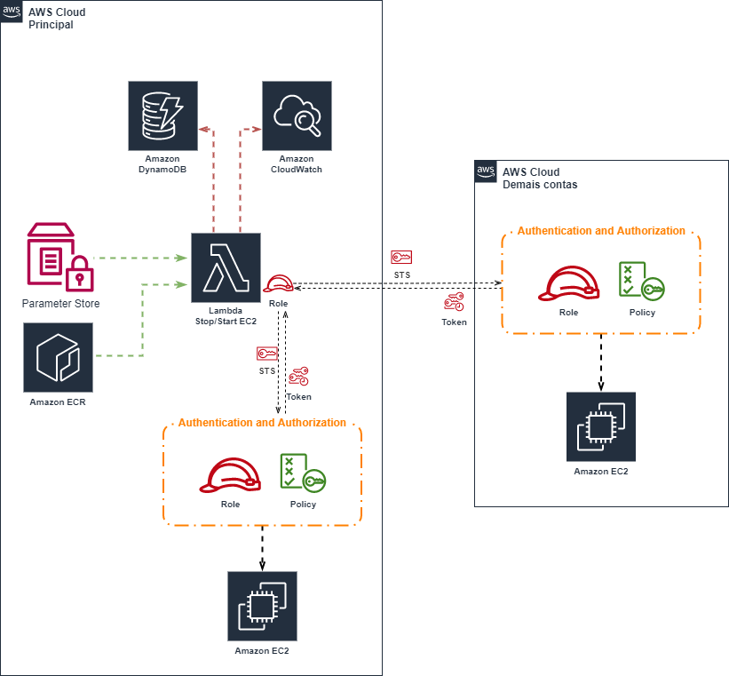

# Lambda Stop/Start AWS EC2 Instances
#### Lambda Function Stop Start AW EC2- Python BOTO3

## Funções e observações:

* Desligamento por ambiente:
    Casos onde a companhia possue todos os recursos em conta única, pode ser especificado quais recursos tagueados por ambiente serão desligados/ligados.

* Desligar/Ligar de EC2 por tag ou todas EC2s em conta específica
    Caso se tem uma conta específica para recursos de desenvolvimento ou sandbox, pode ser configurado para todas as máquinas desligarem independente da tag "environment"
    É possível configurar por exemplo apenas conta AWS de desenvolvimento para desligar todas as máquinas e as demais contas considerar a tag "environment"

* Pode ser definido ordem de desligamento das maquinas que tenham dependência entre si 
    Casos onde o BD precisa ser iniciado antes da aplicação 
    ou também casos de cluster Windows que precise ter ordem ao ligar/desligar para sempre promover node específico como primário

* O desligamento é por Assume role, ou seja, o gerenciamento do código lambda ficará centralizado em uma conta AWS, não necessitando deploy em multiplas contas
    Redução de custo operacional e também gestão otimizada

* O horário flexível para desligar/ligar EC2s
    A maquina irá desligar/ligar de acordo com tag setada, desta forma não se tem um horário hard coded
    Podemos ter casos onde uma Squad possui horário diferenciado e que as máquinas precisariam ser desligadas em horário diferente do default definido

* O log de quais máquinas foram/seriam desligadas são salvos em uma tabela dynamoDB tendo em vista que CloudWatch Logs tem custo elevado.
    Dado fica centralizado em um local para histórico e também throubleshooting 
    Facilita analítico para estimar saving.
    Caso queira que o log também seja salvo no CloudWatch Logs, basta atribuir valor "Y" para variável "log_actions_cw_logs" do Parameter Store "AUTOMATION-STOP-START-EC2"

* Opção de apenas logar o que será executado.
    Em casos de implementações/manutenção do código Lambda, para realizar os testes a fim de estimar se a maquina será desligada ou não, 
    a tag "print_only" pode ser atribuida o valor "Y" para que apenas simule o que seria executado, log ficará na tabela DynamoDB.

* Os horários estão em UTC 0.
    Desta forma a lambda ficará aplicável com característica unica de horário e com melhor entendimento independente de qual(is) país(es) a Companhia atua.

## Descrição do objetivo de cada variável do Parameter Store "AUTOMATION-STOP-START-EC2". 
### Para variáveis multi valores, necessário colocar valores entre cochetes e utilizar virgula como separador.

* **print_only**
    * Valores aceitáveis: "Y" | "N"
    * Multi valor: Não
    * Objetivo: Possibilitar que sejam realizados testes apenas para estimar quais máquinas seriam desligadas naquele horário de execução da Lambda.

* **accounts** 
    * Valores aceitáveis: Id de contas AWS 
    * Multi valor: Sim
    * Objetivo: Definir de forma centralizada quais contas serão englobadas no processo de desligar/ligar EC2s, considerando tag "environment" do recurso.

* **accounts_apply_all**
    * Valores aceitáveis: Id de contas AWS 
    * Multi valor: Sim
    * Objetivo: Definir quais contas dentre as definidas na variável "accounts" serão englobadas no processo de desligar/ligar EC2s SEM considerando tag "environment" do recurso. 

* **assume_role_name**
    * Valores aceitáveis: Nome role AWS
    * Multi valor: Não
    * Objetivo: Role de cada conta AWS a qual a lambda executará processo de desligar/ligar EC2s.

* **regions**
    * Valores aceitáveis: Regioes AWS. https://docs.aws.amazon.com/AmazonRDS/latest/UserGuide/Concepts.RegionsAndAvailabilityZones.html
    * Multi valor: Sim
    * Objetivo: Definir quais regiões a lambda executará processo de desligar/ligar EC2s.

* **sleep_sec_next_order**
    * Valores aceitáveis: Numeral em segundos. Atenção para que a execução total da Lambda Function não ultrapasse limite de execução (15 minutos).
    * Multi valor: Não
    * Objetivo: Quando definido ordem para desligar/ligar EC2, valor deste parâmetro será o tempo de pausa para seguir para próxima ordem.

* **default_utc_stop_hour**
    * Valores aceitáveis: Numeral entre 0 e 23. 
    * Multi valor: Não
    * Objetivo: Quando o recurso não estiver com valor atribuido na tag "utc_stop_hour" para desligar maquina, este será o horário que a maquina desligará.

* **default_utc_start_hour**
    * Valores aceitáveis: Numeral entre 0 e 23. 
    * Multi valor: Não
    * Objetivo: Quando o recurso não estiver com valor atribuido na tag "utc_start_hour" para ligar maquina, este será o horário que a maquina ligará.

* **environments**
    * Valores aceitáveis: String que define ambiente da companhia | "*" 
    * Multi valor: Sim
    * Objetivo: Definir quais ambientes serão considerados na execução da Lambda function (será comparado com a tag "environment" do recurso). 
        Caso definido valor "*" para esta variável, será DESconiderado tag de ambiente do recurso.

## Tags usadas nas Instâncias EC2 que são consideradas no processo de desligar/ligar EC2s:

* **server_name**
    * Valores aceitáveis: Texto qualquer
    * Default: Vazio
    * Objetivo: Geralmente os ambientes possuem tag que referencia nome do servidor, caso sua compahia utiliza outro nome de variável você pode substituir no código a variável "server_name" pela que é utiliza em seu ambiente.

* **instance_name**
    * Valores aceitáveis: Texto qualquer
    * Default: Vazio
    * Objetivo: Nome da instância EC2 (Tag original tem nome "Name")

* **skip_until**
    * Valores aceitáveis: DD/MM/AAAA
    * Default: Vazio
    * Objetivo: Caso atribua valor para esta variável em seu recurso maior que dia atual, o mesmo não passará pelo processo de desligar/ligar via esta lambda function

* **utc_stop_hour**
    * Valores aceitáveis: numeral entre zero hora e 23 com máscara de 2 caracters. [00-23]
    * Default: Valor da variável "default_utc_stop_hour" definida no Parameter Store 
    * Objetivo: Determina a hora do dia a qual a instância será desligada. 
    * Obs: Não pode ter mesmo valor que tag "utc_start_hour" ou variável "default_utc_start_hour" do Parameter Store

* **utc_start_hour**
    * Valores aceitáveis: numeral entre zero hora e 23 com máscara de 2 caracters. [00-23].
    * Default: Valor da variável "default_utc_start_hour" definida no Parameter Store.
    * Objetivo: Determina a hora do dia a qual a instância será ligada. 
    * Obs: Não pode ter mesmo valor que tag "utc_stop_hour" ou variável "default_utc_stop_hour" do Parameter Store.
    
* **auto_start**
    * Valores aceitáveis: "N"
    * Default: Vazio
    * Objetivo: Determina se a instância será iniciada pela Lambda Function. Aplica valor "N" em casos de maquina ter que se manter desligada por muito tempo ou que start da mesma seja apenas manual (sob demanda).
    
* **start_order**
    * Valores aceitáveis: Numeral a partir de zero.
    * Default: "0"
    * Objetivo: Determina a ordem de início das instâncias. Aplicável em casos como quando o BD precisa ser iniciado antes da aplicação ou também casos de cluster Windows que precise ter ordem ao ligar para sempre promover node específico como primário.
    * Obs: É necessário atribuir esta tag quando grupo de instâncias precisa de ordem e este grupo sempre terá ordem iniciada em "0"
    
* **stop_order**
    * Valores aceitáveis: Numeral a partir de zero.
    * Default: "0"
    * Objetivo: Determina a ordem de desligamento das instâncias. Aplicável em casos como quando o BD precisa ser iniciado antes da aplicação ou também casos de cluster Windows que precise ter ordem ao ligar para sempre promover node específico como primário.
    * Obs: É necessário atribuir esta tag quando grupo de instâncias precisa de ordem e este grupo sempre terá ordem iniciada em "0"
